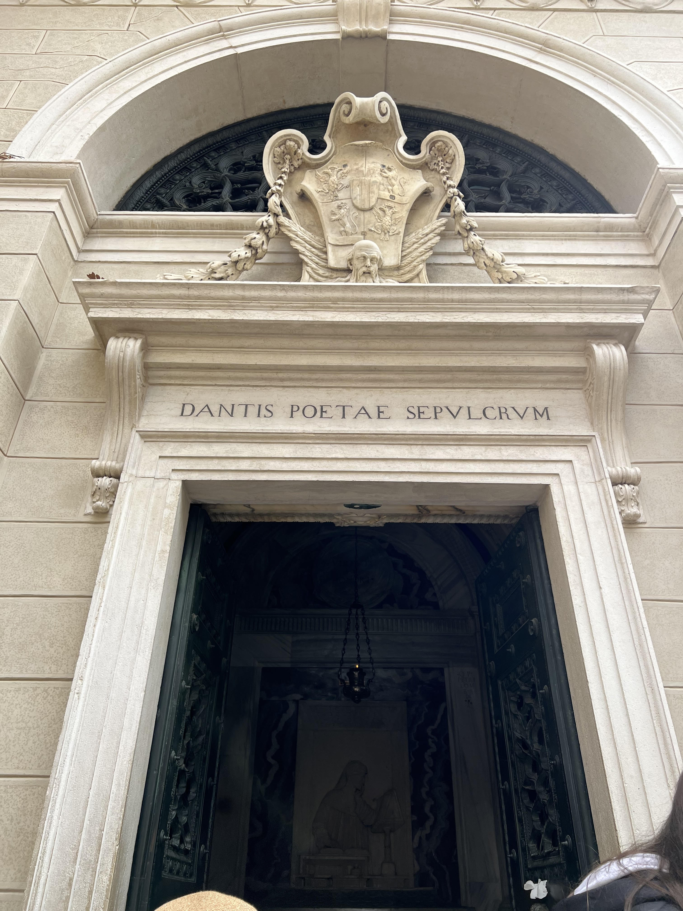

# Andrew Yang
Welcome to my page!
I am Andrew Yang, a **second year** CS student studying at UCSD.

This personal page is divided into two sections, a [programming](#programmer-facts) section and a [personal](#personal-facts) section

## Programmer Facts

I am mainly interested in studying systems, so anything related to networks and operating systems. I have some experience working with [VPP](https://s3-docs.fd.io/vpp/24.06/) in my internship last summer, where I helped implemented a network plugin that encapsulates packets with a proprietary protocol. 

Beneath is a personal checklist of goals and projects I wish to undertake (or have completed):
-  [x] Capture raw L2/L3 packets and alter them on a low-level
-  [ ] Write code that manipulates system cache and memory directly
-  [ ] Design and implement a barebone operating system

My preferred coding languages (by no means exhaustive), in order, is:
1. C `printf("Hello World");`
2. Java `System.out.println("Hello World");`
3. C++ `std::cout << "Hello World";`
4. Python `print("Hello World")`

## Personal Facts

Last spring break I went on a vacation in Italy, visiting the following cities:
- Venice
- Ravenna
- Florence
- Rome

In Ravenna, I was lucky to have passed by Dante's [tomb](img/dante_tomb.jpg);

Here I quote from his *Divine Comedy* which is one of his poems I studied during highschool:

> “All hope abandon, ye who enter here.”

